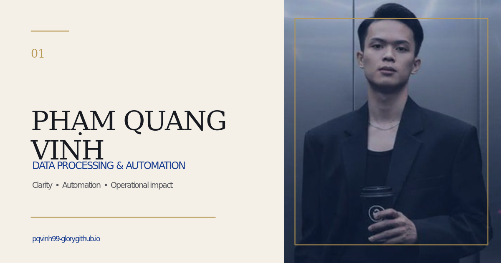

# Phạm Quang Vinh - Portfolio



Trang portfolio cá nhân giới thiệu năng lực xử lý dữ liệu, tự động hóa quy
trình kho vận, SAP Scripting, VBA Excel, AI Agent và trực quan hóa dữ liệu.

## Nội dung chính

- Hero editorial với ảnh chân dung và các chỉ số nổi bật
- Năng lực tự động hóa, xử lý dữ liệu, AI Vision và dashboard
- Kinh nghiệm Warehouse Controller tại ECCO Việt Nam
- Dự án Inventory FG Dashboard
- Chứng chỉ ISO 9001:2015 Awareness & Internal Auditor
- Giao diện responsive, animation và hỗ trợ `prefers-reduced-motion`
- Metadata SEO, Open Graph thumbnail, favicon và liên kết liên hệ

## Chạy dự án

Yêu cầu Node.js `>=22.13.0`.

```bash
npm ci
npm run dev
```

Mở địa chỉ được hiển thị trong terminal.

## Kiểm tra

```bash
npm run lint
npm run build
```

## Deploy bằng Cloudflare Workers Builds

1. Push repository lên GitHub.
2. Vào **Cloudflare Dashboard → Workers & Pages → Create application → Import a repository**.
3. Chọn repository này và nhánh `main`.
4. Vì repository không khai báo `wrangler.jsonc`, Cloudflare sẽ tự nhận diện
   framework và tạo một pull request cấu hình deploy.
5. Kiểm tra preview do Cloudflare tạo, merge pull request, sau đó các commit mới
   trên `main` sẽ tự động build và deploy.

Có thể chuẩn bị cấu hình thủ công trước khi deploy bằng:

```bash
npx wrangler setup
```

## Công nghệ

- Next.js App Router
- React
- TypeScript
- Vinext / Vite
- Cloudflare Workers
